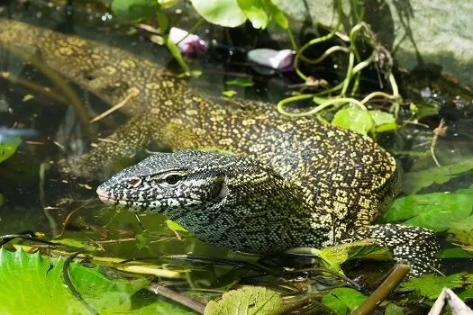
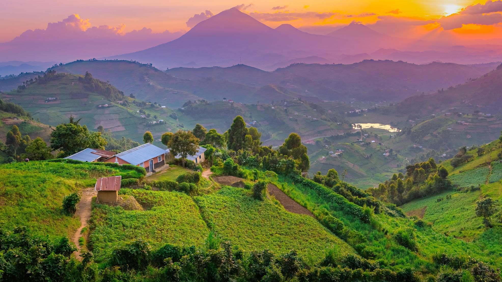
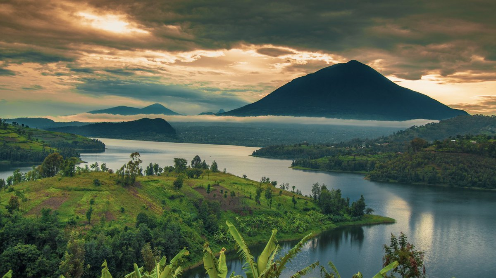

<h3>** Ok, now the About: **</h3>

It is amazing how something so simple like a bike can change things.  Actually two bikes…
My first bike was a classic cruiser, a $110 rusty but very stylish, comfortable, 30 year old cruiser.  Quite perfect for my desired task, which was mostly just getting to work.  However, on my first day of work, someone needed that bike more than I and cut the lock.  Well things happen for a reason.  I called the man I bought that bike from and got the even older, even rustier, even more economical bike which I have now.  The XL frame Raleigh, 1980’s vintage.  Too big for me, this bike is made for someone like 6’2, however it was ready to go.  And thus far has been incredibly reliable and taken me to many new places in a very short time.  So that’s what started this site, a place to post where the bike has led me.  More to come!

** Why videos? **    
Because video is better suited to capture the wide area of the surroundings.  Which is not always necessary, and for example I'm quite pleased with how the Manoa Falls pic turned out.  Plus, video will lay the foundation for the future upgrade to 4D AR, coming soon... 
So video does a slightly better job of putting the viewer in the scene.  Videos are generally too large and laborious to email, hence a site to collect them in one place for sharing.  And while I'm at it, collect pics, stories, and other stuff.  

** Why Github?  **  
Well, it's free, I like that.  It's a place for collaboration, I like that too.  And a chance to learn a bit about the git process, which is a cool thing in a geeky way:  

 

** Why NswaswaJim? **   
It's my old nickname.  Nswaswa is the Nile monitor lizard, a very amphibious large lizard, generally happier when at the water's edge.  Contrary to popular belief, these lizards are pretty much not poisonous (they have very, very mild venom, a bite is far more likely to suffer infection than envenomation.)  The bigger danger than any poison is their tail, which nswaswa will use as a weapon if provoked.  They are often solitary however can be social and are known to hunt together- for crocodile eggs.  More about these animals and my nickname to come, but for now enjoy the pic.

 

PS 
Ok, opening image is NOT from biking around the island.  It was an image I put up as placeholder while making a page template for the site, and is just too good to take down:

It is the evening sun setting in one of the most amazing, magical places that I know of on the entire planet.  Volcanos, high altitude lakes dotted with beautiful islands; three borders and all the culture, trade, and markets that brings, all blending together at the bottom of the slopes of these incredible volcanos.

 

 

