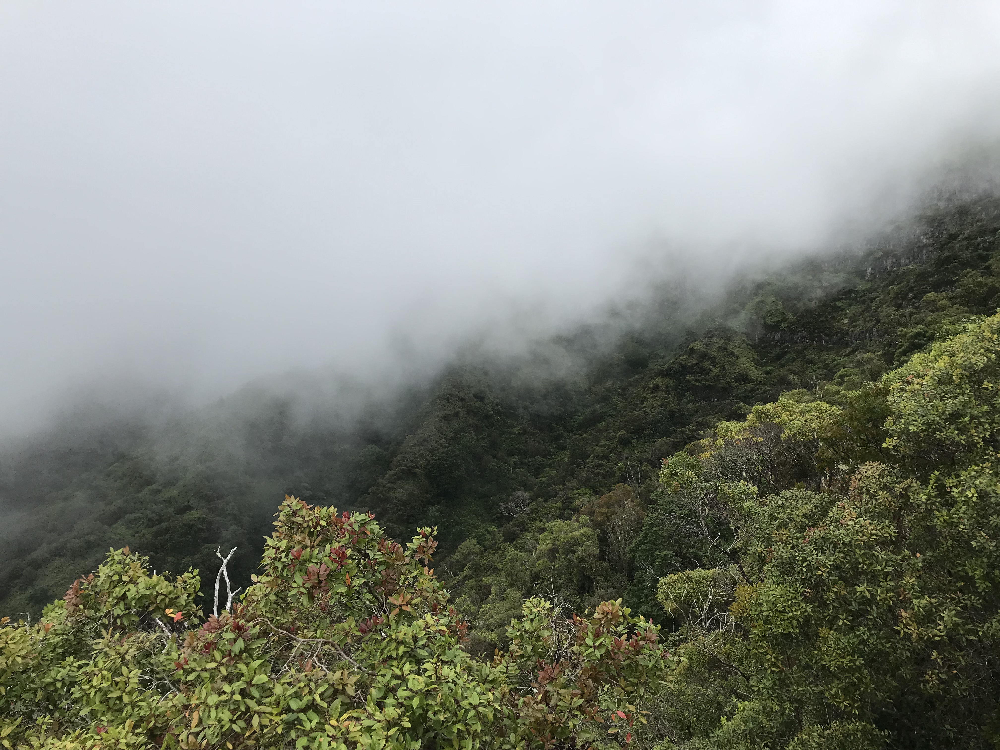
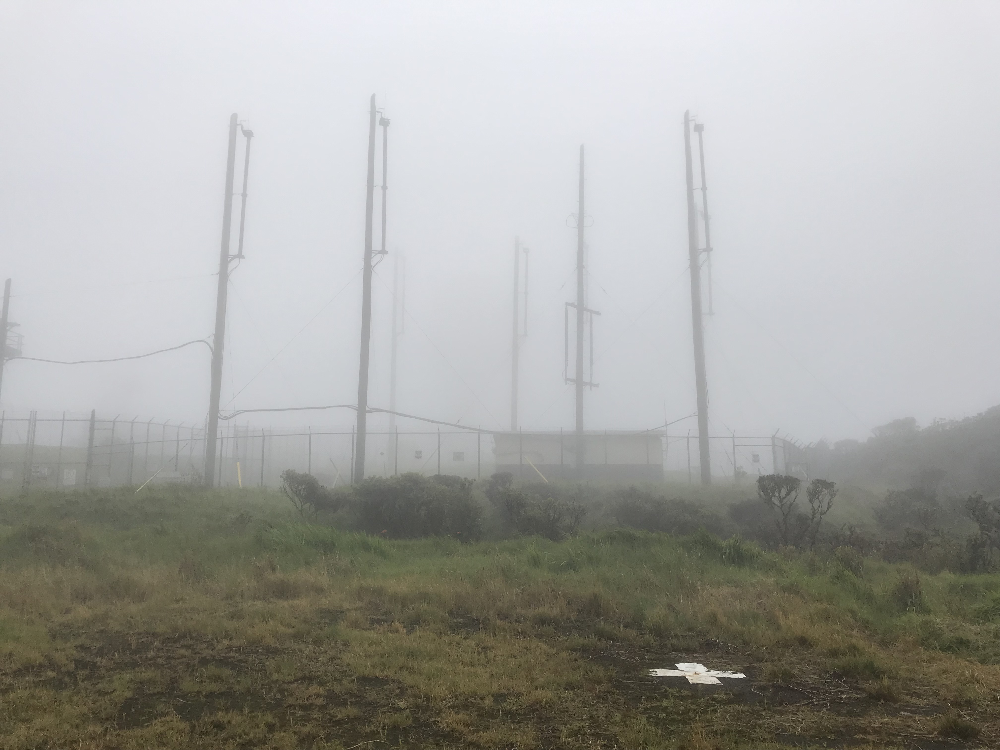

## Kaala, highest peak on Oahu.  First climb.

What started out as just a ride...ended up in a hike to the top of the highest peak on Oahu!  

It was supposed to be just a ride to the trailhead, then a little recon hike.  Wearing sandals and carrying a tiny snack and not enough water.  But eventually ended up on top!  In the cloud, rain, very low vis.  Ok well the recon run actually made it to the top, and left a desire to come back.  

Still in the clear on first hike...

<video width="640" height="480" controls>
<source src="../images/kaala.webm" type="video/webm">
  Your browser does not support the video tag.
</video>

  
All still good, but getting into clouds:

 

By this point I was getting serious about the summit.  Go up.  Don't let sandals, or clouds stop you.  Annoyed Yoda on my shoulder saying "There is no try!!! Do, or do not!!!"

 

According to everything, there's a massive golf/ball radome up here at the top:

 

So, if you just count the result- success!  Made it to the top.  Despite poor planning.  Which gave a reason to come back...

