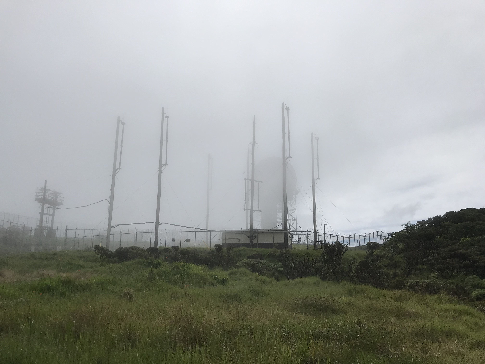

## Kaala, highest peak on Oahu- Second climb

Back to Kaala!  This time with a plan- make the summit, in light hiking boots, with adequate food and water (unlike last time, stumbling to the summit exhausted in muddy sandals.)

We biked from Waianae, past the gate, past the place I had to stop and walk the bike due to steep gradient.  Determinely climbed past those points in lowest gear today.  At this vista I noticed white bubbles coming from a pinhole leak in the front tire- ah, my fix a flat, coming out a different hole...Nothing to do about it now, the summit awaits.  Just time to change mode of transport, from bike to boots.  Was gonna hapen shortly anyway. 

Route:  Blue for bike, red for hike.  (blue mark is actual spot).  Thanks to Alltrails for KML map data for hike portion:

<iframe src="https://www.google.com/maps/d/embed?mid=1TqN_gaBoUwRE5S1eT6X5LbLiD5LyFXg&ehbc=2E312F" width="800" height="600"></iframe>

 Bike, stay here and enjoy the view.  We'll deal with flat later.

The rest of the way up the lead-in road is mostly shady due to eastern ridge and entering the forest.  Not a bad hike- no traffic, this is a gated one-lane access road to the water tank:

 

After the lead-in road the trail begins.   Can be broken into three parts:  The trail, the ropes, and the swamp.  

The trail is a lovely hike through varying types of forest.  Shady, quiet except for the birds.  In general it is steep- but you need to get to the highest peak on Oahu, the trail can't do that by going level.  Tree roots provide natural stairs.

 

When the ropes begin you know the steep is about to get steeper.

 

When the ropse start a few things happen:  You pareallel a fence for as short bit, the fence serving a good purpose.  The views out towards the coast open up beautifully.  And the trail continues to get steeper.

 

 

Views open up on the steep bit:  Panorama towards the coast:

 

<a href="../images/kaala1/IMG_0995.JPG" target="_blank">Panoramic from the steeps in new tab</a>

There are many roped sections.  Ropes does not imply technical climbimg, just something helpful to hang on to especially if it's been raining.  Some stretches are a bit more challenging than others but the pic below is typical:

 

The swamp!  Steeps are over, welcome to Shrek's boadwalk!

 

Radome at the top!  Last time I was here the vis was so low it wasn't even visible from this spot.  Much better this time!

 

Panoramic from the top:

 

<a href="../images/kaala1/IMG_1011.JPG" target="_blank">Panoramic from the top in new tab</a>

Almost forgot the vids:  

ropes, pano, still got some steep above:

<video width="640" height="480" controls>
<source src="../images/kaala1/kaala21.webm" type="video/webm">
  Your browser does not support the video tag.
</video>

  
 pano vid from the top at the edge of the swamp 
<

<video width="640" height="480" controls>
<source src="../images/kaala1/kaala22.webm" type="video/webm">
  Your browser does not support the video tag.
</video>

If you've read this far, you are of course wondering about the flattening tire at the trailhead of this bike 'n hike?  No problem at all...

Half can of fix-a-flat was still packed in the small bag I left on the bike.  It was enough to inflate the tire and slosh some fresh sealant, which...might get me down?  

I jumped back on the bike and down the one lane road.   The front tire was slinging white sealant out on the tiny hole on every rapid revolution.  Brakes are hot, hill is steep, and this little one-lane road has a very hard and unavoidable gate at the end.  So this had multiple ways it could have ended badly.  Yoda on my shoulder reminding me it could all work out ok.

And it did.  Tire stopped slinging sealant and remained inflated all the way down to Waianae.  Buspass can just stay in my pocket.  

In Waianae, a visit to the best West-side bike shop, Hale Nalu, where Derek fixed me up.  Again.  Thanks man!
  